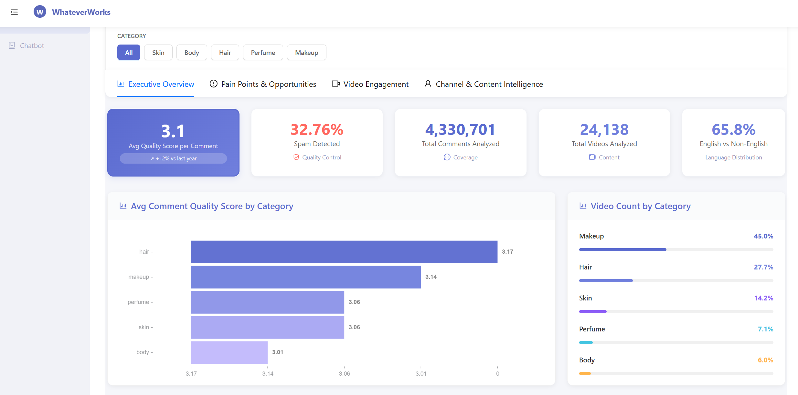
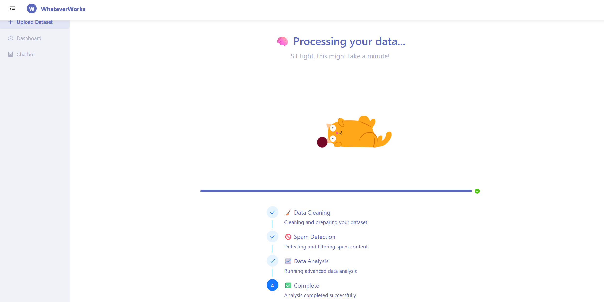
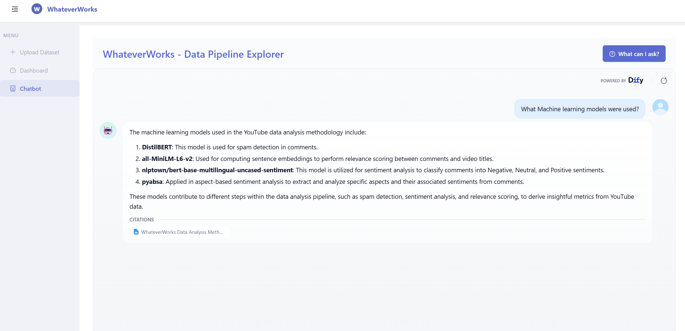
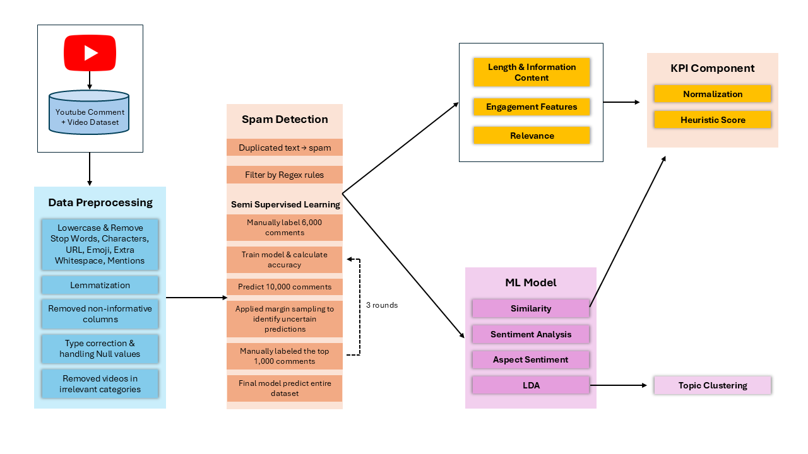
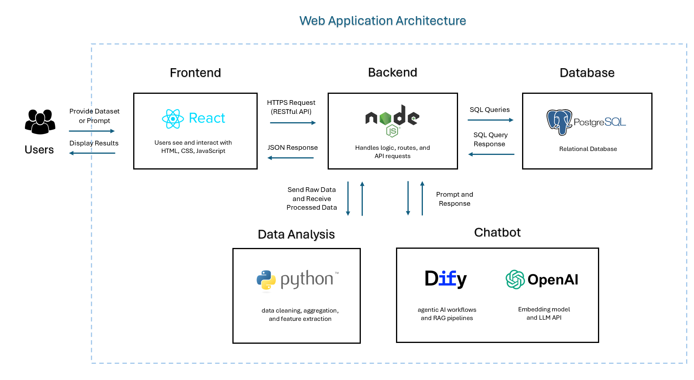

# 🚀 WhateverWorks

AI-powered platform that transforms social media comments and video engagement into actionable business insights, bridging technical analysis with strategy to drive ROI for all teams.

# 📊 Data Analysis Pipeline: Video & Comment Analysis

## Overview

This project builds a full pipeline for analyzing **YouTube videos and comments**. The flow is:

1. Understand and clean raw data
2. Detect and filter spam comments
3. Preprocess videos and comments for NLP tasks
4. Perform relevance scoring, sentiment analysis and Aspect Based Sentiment Analysis
5. KPI and engagement analysis for comment and engagement score analysis for video

The workflow integrates classical preprocessing with modern transformer models for text classification, sentiment, and similarity tasks.

---

## 🔄 Workflow

### 1. Data Understanding & Cleaning

Datasets:

- **Videos Table (videos.csv)**
- **Comments Table (comments.csv)** :5 datasets combined into one

Steps:

- Combined 5 comment datasets
- Checked columns, nulls, unique values
- Visualized numeric features
- Removed row duplicates by commentId & videoId
- Removed non-informative columns

  - Videos: `kind`, `favouriteCount` (always 0)
  - Comments: `kind`

- Data type correction:

  - Converted timestamps → datetime
  - Converted IDs → strings

- Handled null values:

  - Dropped null `textOriginal` comments
  - Removed videos with many nulls

---

### 2. Data Preprocessing (1)

#### **Videos**

- Extract Topic Categories from URLs

  - Use regex to grab anything after 'wiki/' from 'topicCategories' column.

  - Two new columns:

    - 'extracted_topicCategories': List of topics for each video
    - 'extracted_topicCategories_str': Comma-seperated string of topics for each video

  - Flatten and Count frequency of each Topic Category
  - Define and Remove videos with Target Categories (Irrelevant Categories)
  - 'video_filtered': dataframe that contains only videos outside targe categories
  - Remove Videos with like count greater than view count

- Clean_text function performs preprocessing steps including:

  - Lowercasing
  - Expanding Contractions
  - Removing Mentions, Hashtags, Links, Emojis, Punctuation
  - Normalizing elongated words
  - Collapsing whitespace
  - Tokenizing
  - Removing Stopwords
  - Lemmatizing

- 'cleanedText': column created after applying Clean_text function to clean video titles
- Detected English titles (`langid`) → `is_english` column
- Translated non-English titles using Google Translator

#### **Comments**

- Filter out irrelevant videos
- Convert 'publishedAt' -> Datetime
- Sort 'publishedAt' in ascending order
- Added `duplicatedFlag`: same authorId + same videoId + same textOriginal

- Clean_text function performs preprocessing steps including

  - Lowercasing
  - Expanding Contractions
  - Removing Mentions, Hashtags, Links, Emojis, Punctuation
  - Normalizing elongated words
  - Collapsing whitespace
  - Tokenizing
  - Removing Stopwords
  - Lemmatizing

- Tagged duplicated text (checked after cleaning)

---

### 3. Spam Detection

#### Semi-Supervised Spam Detection:

##### Train

###### Filter Spammers

- Calculate duplication ratio per author and video

  - Duplicated comment / total comment
  - Find the maximum duplication ratio across all videos for each author.
  - Idenfity authors as spammers based on duplication ratio (>=0.7)
  - Filter out spammers from main dataset

###### Filter by Regex Rule

- Filter out spam comment based on:

  - missing values
  - presence of links
  - very short comments (<3 words)
  - emoji-only comments
  - comments with emojis more than words

###### Semi-Supervised Training

- Preparation for Manual labeled data

  - Split labeled data into training and validation sets
  - Define Evaluation metrics function including:

    - accuracy
    - precision
    - recall
    - F1

  - Dataset Setup:

    - HuggingFace tokenizer

      - 'Dataset.from_dict'
      - tokenizes training and validation texts

    - Custom PyTourch

      - CommentDataset class used to wrap tokenized encodings and labels

- Initialize Model, Set Training Arguments and Train

  - Train with 6,000 manually labeled comments using pretrained HuggingFace transformer model (DistilBERT).
  - Evaluate performance with Precision, Recall, and F1-score.
  - Predict 10,000 unlabeled comments, returning predicted probabilities (spam vs. not spam).
  - Extract 1,000 uncertain samples by calculating the uncertainty margin.
  - Manually label the uncertain samples and merge with the initial labeled dataset.
  - Retrain the model with the expanded dataset.
  - Repeat the process (prediction → uncertainty sampling → manual labeling → retraining) two more times.

##### Predict

- Semi-Supervised Spam Detection Appplication Pipeline
  - Load Pretrained Model and Tokenizer
  - Flag Duplicates and Spam
  - Select dataset that are not flagged as duplicates or regex-based spam for prediction
  - Define batch scoring funtion for unlabeled data using trained classifier
  - Use the batch scoring function to score comments and add prediction columns
  - Merge Cleaned data with model predictions (regex-based and model-based spam detection)
  - Create final spam label (if duplicate, regex-based spam or predicted as spam by model)

---

### 4. Data Preprocessing (2)

- Filtered dataset with **no spam comments**
- Detected English comments (`langid`)
- Filtered only English comments

Skipped steps (future improvement):

- **Translation** → too slow, may distort sentiment, costly for large-scale
- **Spelling correction** → slang/shortcuts too diverse, existing models (edit distance, noisy channel, grammar correction) failed

---

### 5. Relevance Scoring

- Filter English Comments and merge with Video Metadata
- Used `sentence-transformers/all-MiniLM-L6-v2`
- Compute sentence embeddings for comments and titles
- Compute relevance scores using consine similarity
- Drop video columns to keep file small

---

### 6. Sentiment Analysis

- Load Sentiment model and define scoring functions
- Model used: **nlptown/bert-base-multilingual-uncased-sentiment**
- Batch processing and classify comments into: Negative, Neutral, Positive
- Run sentiment analysis to computes sentiment scores
- Load sentiment-scored comments

---

### 7. Aspect-Based Sentiment

- Used `pyabsa`
- Extracted Aspects and sentiment in batches from each comment

---

### 8. Comment-Level KPI and Engagement Analysis

#### Preparation:

- Merge video metadata with main dataset
- Drop Unnecessary Columns (Unnamed: 0)
- anayze comment frequency (descriptive statistics)
- Calculate comment frequency and repetitiveness

#### Calculate Key Features

i) Moving-Average Type-Token Ratio (MATTR) for lexical diversity

- Analyze word length in comments (descriptive statistics)
- Apply MATTR to measure lexical diversity and calculates Type-Token Ratio (TTR)
- Calculates the correlation between comment length and both metrics
- Log-Transfrom Word Length

ii) Engagement Score

- based on ratio of likes and views

iii) Sentiment magnitude

- Assigns a sentiment label (negative, neutral, positive) based on the highest score

iv) Constructiveness Matrics

- number of aspects per comment
- number of polarized aspect (positive or negative)
- ratio of polarized aspects to total aspects for each comment

v) Relevance Score

- Get from 5. and scale between 0 and 1

#### Combine Key Features as KPI score

- Scale Key Features

  - used MinMaxScaler
  - Scale 'polarized_aspect_count', 'comment_repetitiveness', 'engagementScore' and 'word_length' to [0,1] range

- Calculate KPI

  - Define weights for each scaled feature
  - Compute composite KPI score for each comment using weighted sum
  - Final Output Comment DataFrame

---

### 9. Video Engagement Score Analysis

#### Preparation

- Select list of unique video IDs from the comments dataset
- Keep only videos with comments
- Merge Video Metadata with KPI Data
- Fill Missing Like counts with 0 and check for nulls

#### Calculate Engagement Score and Weighted Engagement Score

- Engagment Score (video)

  - Formula: sum of likes and comments divided by views
  - Clip Engagement Score to [0,1]

- Weighted Engagement Score

  - sum of engagemenr score and the log of likes and comments
  - Scale Weighted Engagement Score (MinMaxScaler)

- Group high weighted engagement score videos (>0.8) by topic
- Final Output Video Dataframe

---

## ⚙️ Models Used

| Task                   | Model/Method                                       |
| ---------------------- | -------------------------------------------------- |
| Spam Detection         | `prajjwal1/bert-tiny` (semi-supervised)            |
| Translation            | Google Translator (skipped in pipeline)            |
| Sentence Transformer   | `all-MiniLM-L6-v2`                                 |
| Sentiment Analysis     | `nlptown/bert-base-multilingual-uncased-sentiment` |
| Aspect-Based Sentiment | `pyabsa`                                           |

---

## 📌 Notes & Limitations

- Translation step skipped (time, cost, risk of sentiment distortion)
- Spelling correction skipped (slang and evolving internet language)
- Lightweight models used (`bert-tiny`) due to hardware limits (RAM)

---

## 🚀 Future Work

- Apply contextual spelling correction with transformer-based models

---

# 🏗️ Web Application Tech Stack

This project is built using a modern full-stack architecture with **React (frontend)**, **Node.js (backend)**, **PostgreSQL (database)**, and additional tools for **data analysis** and **AI chatbot features**.

---

## 🖥️ Frontend

- **React**

  - Provides the user interface.
  - Built with **HTML, CSS, JavaScript**.
  - Users can upload datasets or prompts and view results interactively.

---

## ⚙️ Backend

- **Node.js**

  - Handles application logic, routes, and API requests.
  - Connects the frontend with the database, data analysis, and chatbot services.
  - Provides **RESTful APIs** with JSON responses.

---

## 🗄️ Database

- **PostgreSQL**

  - Relational database for storing datasets and processed results.
  - Accessed through SQL queries from the backend.

---

## 📊 Data Analysis

- **Python**

  - Used for data cleaning, aggregation, and feature extraction.
  - Processes raw datasets and returns results back to the backend.

---

## 🤖 Chatbot & AI

- **Dify**

  - Provides agentic AI workflows and Retrieval-Augmented Generation (RAG) pipelines.

- **OpenAI**

  - Embedding models and LLM APIs for natural language understanding and responses.

---

## 🔗 How It All Connects

1. Users provide datasets or prompts via the **React frontend**.
2. **Node.js backend** sends data to the database, Python services, or chatbot.
3. Results are processed and returned as JSON.
4. The **frontend displays results** to users in real time.
